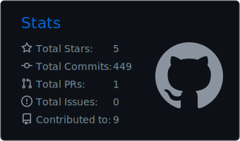
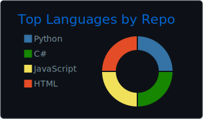

<div align="center">
  
</div>

<div align="center">

[](https://cuozg.github.io/)
[](https://github.com/cuozg)
[](https://github.com/cuozg/oh-my-skills)

</div>

---

## 🎮 About

```
▸ Senior Unity Developer · 15+ years shipping games
▸ Client Lead at GearGames
▸ Systems architect — from blank project to shipped product
▸ Currently: learning AI hard for real production workflows
▸ Building oh-my-skills — AI skills & workflow automation for engineers
```

---

## 📊 GitHub Stats

<div align="center">
  
  
</div>

<div align="center">
  
</div>

---

<div align="center">
  
</div>

<div align="center">
  
</div>

<!--SNAKE-->
<p align="center">
<a href="https://github.com/cuozg">
   
</a>
<a href="https://github.com/cuozg">
 <picture>
  <source media="(prefers-color-scheme: dark)" srcset="https://raw.githubusercontent.com/cuozg/cuozg/pacman/pacman-contribution-graph-dark.svg">
  <source media="(prefers-color-scheme: light)" srcset="https://raw.githubusercontent.com/cuozg/cuozg/pacman/pacman-contribution-graph.svg">
  
 </picture>
</a>
</p>

---

## 🛠 Skills & Tools

**Game Development**


**Tools & Workflow**


**AI & Automation**


---

## 🚀 Featured Projects

| Project | Description |
|:--------|:------------|
| [**oh-my-skills**](https://github.com/cuozg/oh-my-skills) | AI skills, workflow automation, and production-minded tooling for better engineering work |
| [**cuozg.github.io**](https://github.com/cuozg/cuozg.github.io) | Personal portfolio — emerald theme, live GitHub integration |

---

<div align="center">
  
  <br/><br/>
  _Building games by day, building tools by night._
</div>
